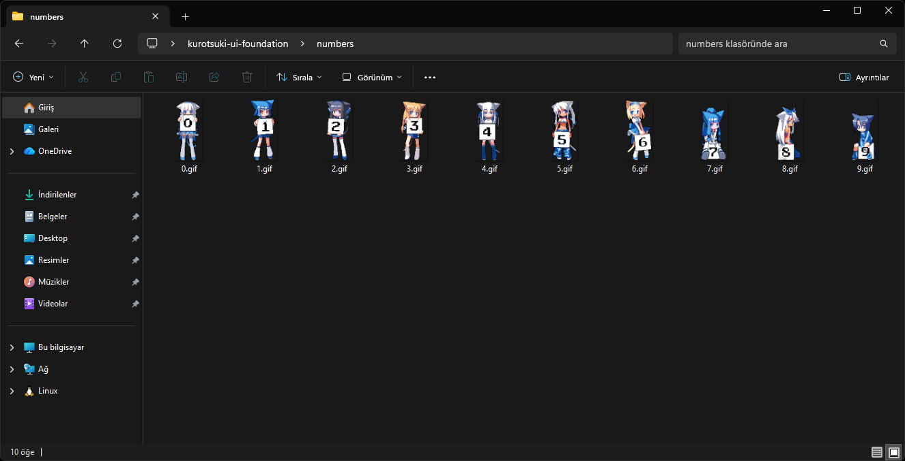
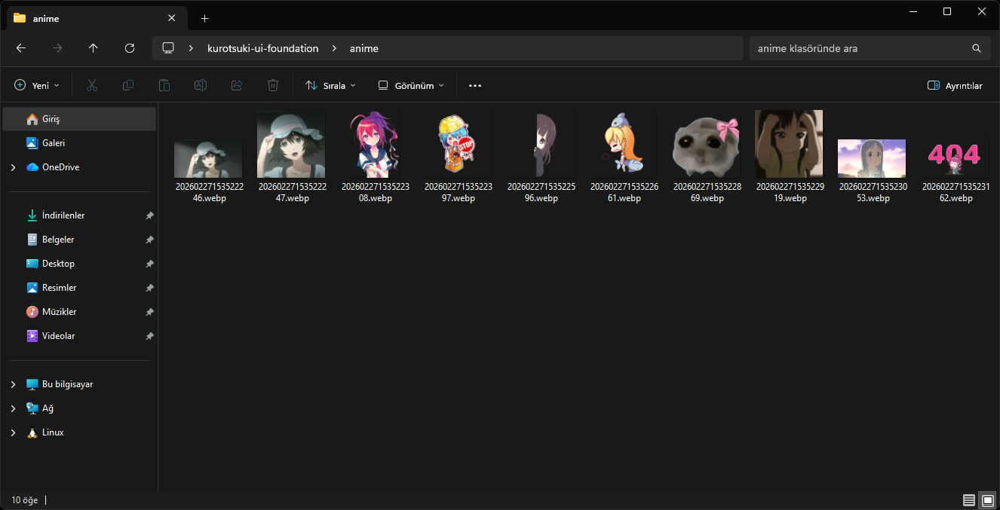
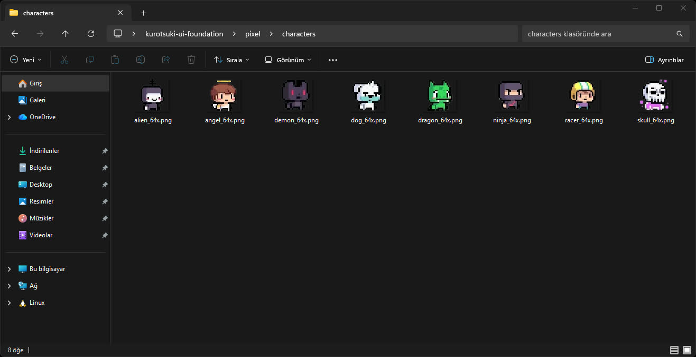
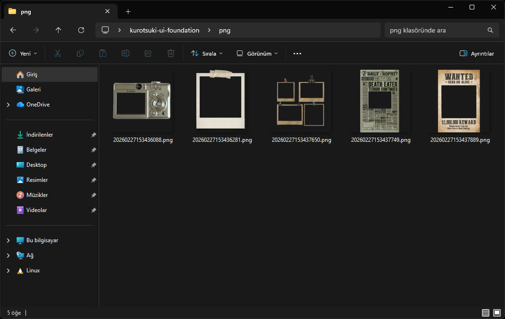

## 📋 About

**EN - ENGLISH**

In this repo, I store and organize images, logos, icons, and similar assets that I frequently use while designing websites or other projects, so I can access them quickly. It includes a variety of useful resources like expressive anime images, SVG country flags, my own logos, pixel designs, overlay PNG effects, and demo content such as PDFs, certificates, and videos for websites. Excluding the flags, there are around 100–120 useful assets, and the whole repo is about 10–15 MB in size.

#

**TR - TÜRKÇE**

Bu repoda, web sitesi veya farklı tasarımlar yaparken sık sık kullandığım görselleri, logoları, ikonları ve benzeri içerikleri hızlıca erişebilmek için kategorize ve optimize ederek saklıyorum. İçerisinde tasarımda işe yarayacak birçok materyal bulunuyor: duygu ifade eden anime görselleri, SVG ülke bayrakları, kendi logolarım, pixel tasarımlar, overlay PNG efektleri ve web sitelerinde kullanılabilecek demo PDF, sertifika ve video gibi içerikler. Ülke bayrakları hariç yaklaşık 100–120 adet faydalı içerik var ve repo toplamda 10–15 MB civarında.

#

#

#

